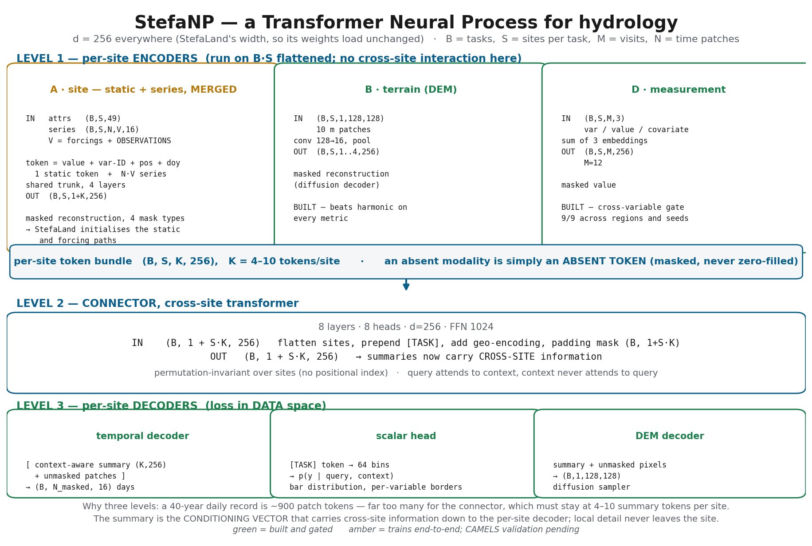
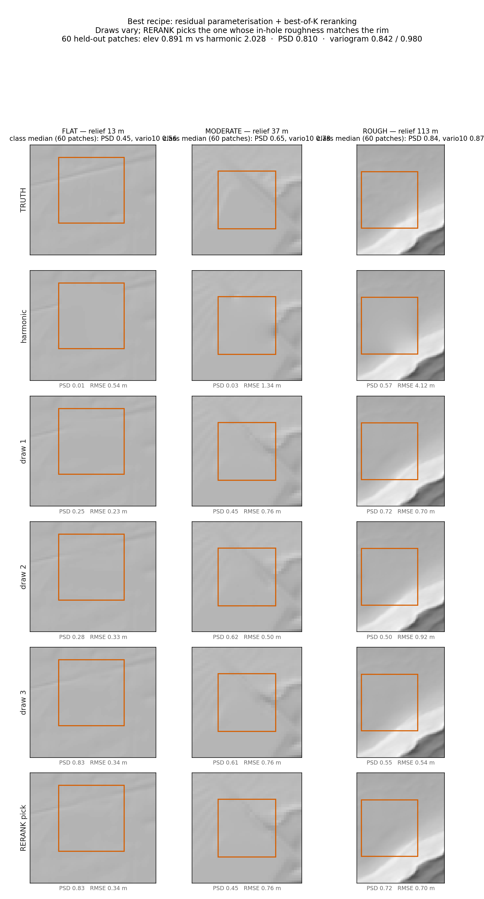
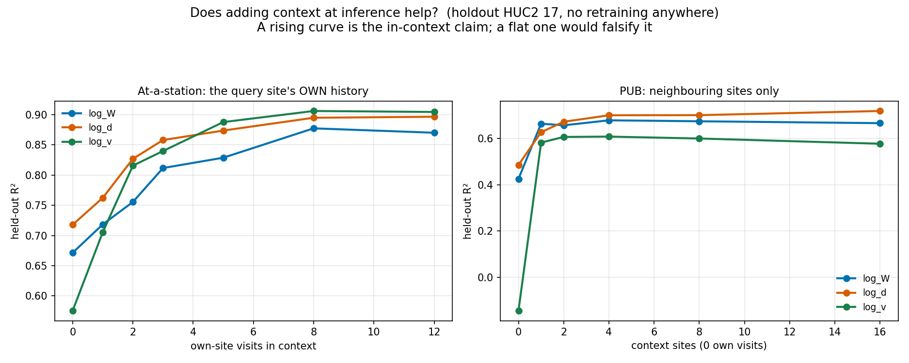

# hydroPFN / StefaNP

A multimodal masked autoencoder whose prediction is conditioned on a **retrieved
context set of sites** — a Transformer Neural Process for hydrology.

Sibling to [StefaLand](https://arxiv.org/abs/2509.17942), extending it with the
three things it does not have: **cross-site in-context inference**, **DEM pixels
as a modality**, and **irregular point measurements as tokens**.



---

## Status

Two components are built and measured. Two are templates. Nothing here is a
promise — every number below came from a leave-region-out run, and the failures
are on the page next to the passes.

| component | state |
|---|---|
| **B · terrain (DEM)** | built — conditional diffusion sampler, beats interpolation on every metric |
| **D · measurement** | built — in-context model, cross-variable gate replicates 9/9 |
| **A · site (static + series, MERGED)** | trained on real CAMELS, leave-region-out — ablations pass, **U3 gate (beat a regional LSTM) not yet run** |
| **connector (cross-site)** | **built and TESTED — ungauged basins predicted at R² 0.853 by conditioning on nearby gauges (+0.38 over no context), beating donor-averaging at every K** |

---

## Result 1 — the DEM sampler beats interpolation on every metric

A deterministic net is capped at ~0.31 of true fine-scale spectral power, and
that cap is *structural*: an L1/L2 loss returns the conditional mean, and the
mean of plausible terrains is smooth. Only a sampler can commit to one sharp
realisation.

Final recipe = **residual parameterisation + best-of-K reranking**.
60 held-out 1° tiles, K = 8 draws. Success bands were fixed **before** running.

| | **StefaNP** | harmonic | best deterministic U-Net |
|---|---|---|---|
| in-hole elevation RMSE | **0.891 m** | 2.028 | 1.88 |
| slope RMSE | **0.0328** | 0.0425 | 0.047 |
| slope Wasserstein-1 | **0.0072** | 0.0229 | 0.008 |
| short-λ PSD ratio (1.0 = right) | **0.810** | 0.175 | 0.31 |
| semivariogram ratio, 10 m | **0.842** | 0.376 | 0.42 |
| semivariogram ratio, 80 m | **0.980** | 0.529 | 0.52–0.64 |

Beating harmonic on the *pointwise* metrics and the *distributional* ones at
once is the substantive result. Pointwise error structurally rewards the
flattest consistent surface — harmonic provably **is** that surface — so a
textured method normally pays for its texture in RMSE. Doing both means
reconstruction, not decoration.



### What was tried, and what worked

Five ideas, each run as its own arm so the effects are attributable.

| change | verdict | rerank elev | rerank PSD |
|---|---|---|---|
| baseline (ε-pred, generate the surface) | — | 1.192 | 0.803 |
| **best-of-K reranking** | **works** (no training) | — | 0.662 → 0.803 |
| **residual over harmonic** | **works** | **0.891** | **0.810** |
| v-parameterisation | **hurts** | 1.374 | 0.723 |
| all three stacked | worse than residual alone | 1.210 | 0.802 |
| uniform-CONUS patches | premise refuted | — | — |

**Reranking**: draw K, keep the one whose in-hole variogram best matches the
*surrounding rim*. The rim is observed at inference, so this is method, not
oracle picking — and it is justified by the spread (single-draw PSD runs p10
0.14 / median 0.66 / p90 1.95, so a good draw usually *exists*).

**Residual**: generate the *departure* from the harmonic surface. Harmonic
already solves the low frequencies exactly, so making the net re-derive them
wastes capacity on the part that was never the problem. This removes the
texture-vs-fidelity trade-off entirely: on the baseline, reranking **cost**
elevation accuracy (1.058 → 1.192); with the residual it **improves both**
(1.045 → 0.891).

> **A single stacked "all improvements" run would have shown a modest gain over
> baseline, and all three changes would have shipped — when two of them are
> actively harmful on top of the third.** One change per arm, three GPU-hours
> in parallel, correct answer.

---

## Result 2 — the model learns from a site's own measurements, better than a hand-built feature can

Concretely. Take a river site where somebody measured **width** on several
visits, and you want to know the **velocity**. Two ways to use those width
measurements:

**Hand-engineering.** Invent a feature: *"the median amount this site's width
deviates from what its attributes predict, across its other visits."* Feed that
one number to a random forest. Gain: **+0.041 R²** on velocity.

**In-context.** Hand the model the raw measurements as tokens —
`(width, 47 m, at discharge 3.2)`, `(width, 61 m, at discharge 8.1)` — and let
it work out what they imply. Gain: **+0.127 R²**.

Same raw data, **2.3× more extracted**. That is the argument for the
architecture: you do not have to invent a clever feature for each variable
pair and each measurement pattern — the model learns them. And those
measurements are supplied **at prediction time, with no retraining**, which is
what "in-context" means here.

Why does knowing width tell you about velocity at all? Because `W·d·v = Q`:
at a given discharge, a site that runs anomalously wide must be anomalously
shallow or slow. The data supply *how that trade-off splits* at this particular
site — and that split is real channel-shape information no attribute table
contains. (Same-visit measurements are excluded from context throughout, so
this is cross-visit inference, not arithmetic on one row.)

The measurement unit (D) trained on 64,797 HYDRoSWOT visits at 5,057 sites.
Acceptance gates were fixed before any run, then **replicated over 3 holdout
regions × 3 seeds**:

| gate | median | min | max | pass |
|---|---|---|---|---|
| cross-variable (predict velocity from a site's *width* history) | **+0.1265** | +0.0965 | +0.3029 | **9/9** |
| at-a-station vs a per-site power law | +0.0967 | −0.0072 | +0.2727 | 24/27 |
| zero-context vs an attributes-only RF | +0.0043 | −0.0601 | +0.0451 | 21/27 |

The cross-variable effect is **2.3× what a hand-built feature achieved** on the
same data, even at its worst run. Zero-context sits at *parity* with a tuned
random forest — it matches, it does not beat.



Adding observations at inference, with **no retraining anywhere**, raises
accuracy monotonically (velocity R² 0.575 → 0.906 over 0 → 8 own-site visits).
Neighbouring sites give a **step**, not a curve (−0.145 → 0.582 on the first
neighbour, then flat to 16) — the model calibrates from one neighbour but does
**not** aggregate across many. Fixed context size during training is the likely
cause; randomising it is the untested fix.

---

## Result 3 — the merged site encoder, on real CAMELS

CAMELS_Frederik.nc: **671 basins x 12,784 days (1980-2014)**, 26 static
attributes, daymet forcings, no missing values. Leave-region-out by USGS
drainage-basin code — regions 01, 11, 17 held out, **124 basins the model never
saw**. Streamflow is log1p'd and reconstructed in 16-day patches.

| mask (= inference mode) | model | no attrs | attr gain | climate gain | **physical gain** | climatology | persistence |
|---|---|---|---|---|---|---|---|
| random span (gap filling) | 0.606 | 0.565 | +0.042 | +0.002 | −0.041 | −0.000 | −0.008 |
| causal tail (forecasting) | 0.802 | 0.642 | +0.160 | +0.017 | **+0.089** | −0.053 | −0.635 |
| whole variable (cross-var) | 0.822 | 0.627 | +0.195 | +0.072 | **+0.094** | −0.006 | −0.380 |
| **whole site (PUB)** | **0.769** | 0.561 | +0.208 | +0.042 | **+0.116** | −0.043 | −0.977 |

**Whole-site is the mode this design exists for** — every observation hidden,
in a region never seen — and it reaches R² 0.769 from forcings and attributes
alone.

**The split ablation is what makes the attribute result meaningful.** CAMELS
ships `p_mean`, `pet_mean`, `aridity`, `frac_snow` and the precipitation
frequency/duration terms — all aggregates of the forcing series the model
already reads. Handing those over is not new information. Splitting the
ablation shows the gain comes from the **physical** half (soils, geology,
slope, area: +0.089 to +0.116), which *exceeds* the climate half (+0.017 to
+0.072). Without that split, `attr_gain` of +0.21 would have read as proof of
catchment learning when it might have been the model reading a summary of its
own input — the same trap as the `W·d·v = Q` identity, caught before it was
claimed.

Two things stated plainly:

- **This has NOT passed its U3 gate.** The build plan requires beating a
  **regional LSTM**; that has not been run. Climatology (≈0) and persistence
  (negative) are weak baselines and the bar here was low.
- On `random span`, `physical gain` is **negative** (−0.041): when surrounding
  streamflow is visible, physical attributes slightly hurt. That row's n is
  also only 1,712, because the random-span mask picks a channel at random and
  lands on `QObs` about one time in six.

A synthetic rainfall-runoff generator (`data/forcing.py:synthetic`) reaches R²
0.97–0.99 with attribute gains of 0.40–0.71. That is a **machinery test only** —
the generator was written here, so the model recovering it is close to
circular. It is retained because it makes the ablation demonstrably sensitive,
and because it exposed one way synthetic data misleads: persistence dominated
there and is strongly negative on real CAMELS.

---

## Result 4 — prediction in ungauged basins, from context alone

**Temporal split, three arms, all trained on 1980–2004 and evaluated in April
2006 with a 608-day gap:**

| arm | R² |
|---|---|
| regional LSTM **with the test gauges in training** (the ceiling) | **0.8606** |
| **ours — never sees the query gauge** | **0.8447** |
| regional LSTM without the test gauges (standard PUB) | 0.7553 |

> **Conditioning on nearby gauges recovers 85% of the value of actually having
> the gauge** (0.0894 of a 0.1053 gap), for a basin never gauged, in a region
> never trained on, in a period never trained on.

We land *below* the ceiling, as physics requires. The temporal split costs us
0.008 and the LSTM control 0.007 — so the result is **not** period
memorisation.

The load-bearing claim. A query basin in a **region the model never trained
on**, with **every streamflow observation hidden**, predicted by conditioning
on K nearby gauged basins at inference — no retraining.

All at the same holdout, same window, same target:

| model | median of 3 seeds | spread |
|---|---|---|
| **with K=4 nearby gauges** | **0.8528** | 0.008 |
| unit A standalone (no context capability) | 0.7782 | 0.016 |
| regional LSTM | 0.7625 | 0.014 |
| donor-averaging (`ctx_mean`, K=4) | 0.8293 | — |
| nearest-neighbour donor | 0.7850 | — |

**Context is worth +0.075 over a well-trained no-context model and +0.090 over
a regional LSTM** (worst-case across seeds: +0.065 and +0.090), and it beats
donor-averaging — the method operational PUB actually uses — at every K.

Unit A standalone and the LSTM are a **tie** (+0.016, inside both spreads), so
essentially all of the advantage over the field's workhorse comes from the one
thing an LSTM structurally cannot do: read neighbouring gauges at inference.

> An earlier version of this README claimed **+0.38** from context. That
> compared against the PUB model's own K=0 mode (0.4714), which is *damaged*:
> the same encoder reaches 0.7879 trained without context machinery. The
> correct comparison is against a competent no-context model. **Do not use the
> +0.38 figure.**

**The two-path design costs something real**: adding context capability drops
the no-context mode from 0.7879 to 0.5259. Ship the PUB model where neighbours
exist and unit A where they do not.

Two findings behind it, both the product of being wrong first:

- **Neighbours, not lookalikes.** Attribute-similar basins on the far side of
  the continent see different weather on the same day and are worth nothing
  (+0.0000). Basins ~32 km away share storms and are worth +0.38.
- **Pooled summaries destroy the signal.** Letting each query patch attend to
  context patches at the SAME time position took the model from 0.556 to 0.853
  with nothing else changed. The connector's time-pooled tokens are right for
  transferring basin character and wrong for transferring today's weather.

**Versus a regional LSTM** (the field's workhorse, same basins, same 16-day
patch scoring): we win with context — 0.853 vs 0.750 and 0.728 vs 0.707. The
PUB model's K=0 mode looks weak (0.36–0.47) but that is a training-allocation
artefact: K=0 gets one step in six. Unit A trained standalone reaches **0.7631,
beating the LSTM's 0.7498** on the same split. We do use 24× the LSTM's
parameters. See `docs/pub_test_plan.md`.

**Replicated** over 3 seeds (peak spread 0.008) and a second region set: gain
+0.368 to +0.401, beating donor-averaging in 4/4 runs at every K. The second
region set is harder in absolute terms (peak 0.728) yet the gain is identical
and the margins larger — the effect belongs to the method, not to easy basins.

See `docs/pub_test_plan.md`, including the two mis-specified tests that came
first.

## Layout

```
src/hydropfn/
  data/     dem.py          3DEP patch acquisition (gage-centred or uniform CONUS)
            folds.py        leave-region-out and grouped splits
            forcing.py      CAMELS loader + synthetic generator + mask sampler
  models/   diffusion.py    DEM sampler: U-Net, cosine DDPM, conditional DDIM
            inpaint.py      masks, harmonic / IDW baselines, PConv U-Net
            measurement_pfn.py   the built in-context model (unit D + connector)
            site_encoder.py the merged unit A: static + series, one trunk
            encoders.py     superseded notes on the A/C merge decision
            connector.py    TEMPLATE — general cross-site transformer
            decoders.py     TEMPLATE — per-modality decoders
            stefanp.py      TEMPLATE — the assembled model
  metrics/  terrain.py      slope, hillshade, PSD, semivariogram, slope-W1
  train/    train_dem_sampler.py       built
            train_measurement_pfn.py   built
            train_site_encoder.py      built (unit A, masked reconstruction)
            train_stefanp.py           TEMPLATE — the four-stage plan
scripts/    figure and deck generation
experiments/  the evidence base (see below)
tests/      test_smoke.py   invariant checks; run after any lib edit
docs/       architecture.md, environments.md, stefaland_reuse.md,
            proposal_seed.md, dev_log.md, code review
```

The templates are not placeholders — each carries the design decision, the
tensor contract, and the traps found the hard way. Read them before implementing.

## Reproduce

```bash
source gpuenv.sh                      # suntzu: see the traps documented inside
export PYTHONPATH=$PWD/src
PATCHES=/nfs/data/cxs1024/dem_foundation/logs/dem_patches.npz

python tests/test_smoke.py                                    # ~10 s
python -m hydropfn.train.train_dem_sampler --patches $PATCHES \
    --residual --epochs 300 --n-eval 60 --k 8 --tag residual   # ~2.3 h
python -m hydropfn.train.train_measurement_pfn \
    --table <train_table_dem.csv> --holdout 03 --seed 0        # ~15 min
python scripts/fig_dem_sampler.py --patches $PATCHES --ckpt logs/residual.pt
```

DEM patches are ~300 MB and live on suntzu; regenerate with
`python -m hydropfn.data.dem --uniform --min-relief 1.0 --max-per-tile 12`.

## The evidence base

`experiments/` holds the measurements the design rests on — including the ones
that killed ideas:

| script | what it settled |
|---|---|
| `cross_variable_context.py` | a site's cross-visit width anomaly is worth +0.041 R² on velocity |
| `atastation_icl.py` | in-context beats train-once on identical information |
| `residual_learnability.py` | geometry residuals are **not** learnable from terrain (all cells negative, two fold structures) |
| `lithology_premise.py` | terrain → lithology fails once the topographically-defined class is removed |
| `sgmc_noise_floor.py` | the geology label ceiling is 0.91, so 0.593 was not noise-limited |
| `dem_hedging_diagnostic.py` | an L1 net *deletes* sharp channels rather than blurring them |
| `repair_site_no.py` | recovers 15% more usable rows; refuses a looser join its own guard rejects |

## Standing rules

Every number here was produced under these, and each exists because breaking it
once produced a confident wrong answer:

- **Split by site, never by COMID.** A COMID split silently duplicated 1,360
  sites across both arms.
- **Identical row/site population across compared models.** A forgotten control
  turned a real +0.024 into an apparent +0.090.
- **Report seeds, not single runs.** Same-config spread reached 0.11 in
  `psd_ratio` — larger than the effect being claimed at the time.
- **Exercise a metric on a known input before believing a table built from it.**
  Three separate metric bugs produced confident, wrong tables first.
- **When variables are algebraically linked, exclude the measurement occasion,
  not the measurement.** `W·d·v = Q` inflated the cross-variable gain from
  +0.108 to +0.141 until whole occasions were excluded.

## Known weaknesses

- **Sampler quality tracks terrain**: PSD 0.841 rough / 0.652 moderate / **0.452
  flat**. It does not continue anthropogenic linear features (roads, canals) —
  a natural-terrain prior gives no reason to.
- **The connector does not aggregate context sites** (see Result 2).
- **The existing DEM training set is latitude-biased** — tiles were walked in
  sorted order, so its 404 tiles skew south. Fixed in `data/dem.py`, but the
  shipped checkpoints predate the fix.
- **Thin channel-following water masks — the actual target — are untested.**
- Single seed per sampler arm; the ordering is likely solid, the exact numbers
  are not.

---

## How this model is trained: the draw structure

**Read this before interpreting any number in this repo.** What the model can
do at inference is decided by what was *asked of it* during pretraining, and
nothing else.

### "Mixture" means a mixture of MASKING TASKS

Not mixture-of-experts, not a data mixture. The `--mask-mix` flag samples
**which kind of hole** is punched in the query's data on each training task,
instead of always punching the same one.

Every capability here is created by a hole. The model is only ever asked to
fill in what was hidden — so **the shape of the hole is the task**, and the set
of shapes seen during pretraining is exactly the set of capabilities that
exists at inference.

| hole shape | what it enforces |
|---|---|
| `whole_site` — all query discharge hidden | predict a basin with **no** record (ungauged / PUB) |
| `causal_tail` — hide everything after *t* | forecasting and data assimilation |
| `random_span` — hide a contiguous chunk | gap filling (a sensor was down for three weeks) |
| `whole_variable` — hide one variable | cross-variable inference (infer precipitation from discharge) |
| self-as-context | use a site's **own** lagged record through the same interface as a neighbour's |
| K = 0 vs K > 0 | one set of weights must be both a standalone forward model and a context-conditioned one |
| attribute masking | recover static properties from dynamics |

### What is actually drawn

Headline configuration (`--k-train 0,0,0,1,2,4,8,16 --self-ctx-p 0.4`):

| draw | granularity | distribution |
|---|---|---|
| K (context size) | per **step** | K=0 **37.5%**; K ∈ {1,2,4,8,16} **12.5%** each |
| self-as-context | per **step** | present **40%**, tail ~ U{1…15} patches |
| mask kind | per task | `whole_site` **100%** — the mixture is **off** in every headline run |
| window start, query basin | per task | uniform |
| context sites | deterministic | K geographic nearest |

Four effective task types:

| | K=0 | K>0 |
|---|---|---|
| no self-context | forward model **22.5%** | neighbour assimilation **37.5%** |
| self-as-context | self assimilation **15%** | self + neighbours **25%** |

### The finding that governs all of this

**Nothing here is zero-shot.** The identical architecture evaluated on
self-as-context *without* that task in training scores **0.2490**; with it as a
training draw, **0.7878**. A capability absent from the pretraining
distribution does not exist at inference — verified mechanically as well: in a
K=0-only checkpoint the cross-site attention weights sit at their random
initialisation to five decimals, because that code path never executed.

Two consequences readers should carry:

- **The distribution is thin** — four task types, one hole shape. That is
  defensible for the present results, but it is *not* a task distribution in
  the TabPFN sense. Anything outside those four cells will not work.
- **Presence is not enough; share matters.** With K=0 at only 1/6 of tasks the
  forward pathway scored 0.658; upweighted it reaches 0.7164 and ties a
  regional LSTM. The same default cost the 1-day-lead assimilation task 0.17.

Draws still missing for the intended global, multivariate, DEM-integrated
model — forcing-variable dropout, context with a different variable set than
the query, cross-site cross-variable transfer, modality dropout, context from a
different period, window-length draws, realistic gap patterns, and K up to
20–50 with mixed entry types — are enumerated with rationale in
`dem_foundation/docs/dev_dem.md`.

---

## Results by task

> **[docs/all_results.md](docs/all_results.md) — every number in one
> table with its protocol column.** Numbers here span four protocols and
> comparing across them has produced wrong conclusions repeatedly; that
> page states which rows may be compared.
>
> Full benchmark detail — the reference results we compare to (with
> their protocols), the exact command behind every number, and how to
> verify the train/test split — is in **[docs/benchmarks.md](docs/benchmarks.md)**.
>
> Verify the split before trusting any number:
> `python scripts/verify_split.py --nc data/CAMELS_Frederik.nc`

All numbers are **median per-basin NSE**. **Protocols differ between blocks and
are not cross-comparable.**

### The split: PUR, not random holdout

Held-out set is defined by **USGS HUC2 region code** (`station_id[:2]`), and
regions `01` (New England), `11` (Arkansas–White–Red) and `17` (Pacific
Northwest) are removed **entirely** — 124 query basins, 547 training basins.
This is Prediction in Ungauged *Regions*, not random k-fold basin holdout:

```
held-out query -> nearest TRAINING basin: median 1.73 deg  (~190 km)
                  nearest ANY basin:      median 0.29 deg
```

Random holdout would put a training basin ~0.3° away. Two consequences worth
stating precisely:

- The **model** is trained PUR — it has never seen these regions.
- At inference, `--context-pool all` lets context come from other held-out
  basins ~0.29° away. Those are gauges the model never trained on, so this is
  not a leak, but the setting is *"ungauged basin in an ungauged region, with
  nearby gauges that were never used for training"* — not *"no gauges exist"*.
  At K=0 it is pure PUR.

Temporal split throughout: train windows end day 9000, evaluation at day 9600.

### Task 1 — forward run (no discharge anywhere)
*512-day window, all patches scored*

| | NSE |
|---|---|
| regional LSTM (our bar, same split) | 0.7173 |
| **ours, one checkpoint** | **0.7268** |
| ours, forward specialist (3 seeds) | 0.7164 / 0.7208 / 0.7321 |
| *Jamaat 2025, δHBV no DA* — **gauged basins** | *0.75* |
| *Jamaat 2025, LSTM no DA* — **gauged basins** | *0.74* |

A tie with the LSTM on an identical split. The italic rows are on basins that
were **in training**; ours are not, so those are context, not a ranking.

### Task 2 — self t−1 (own gauge, no neighbours)
*patch=1, 64-day window, true 1-day lead, 200 rolling origins*

| | NSE |
|---|---|
| **ours** | **0.8765** |
| *Jamaat 2025, variational DA* — **gauged** | *0.82* |
| *Yang 2026, h-Diffusion + inpainting DA (hourly)* — **gauged** | *0.832* |
| ours, 180-day window | 0.8674 |

Ours is a **single forward pass with no optimisation at inference**; variational
DA solves an optimisation per assimilation step.

### Task 3 — neighbours up to t (concurrent)
*16-day tail, 40 rolling origins*

| | NSE |
|---|---|
| **ours, K=8 + self-context** | **0.8822** |
| ours, K=8 | 0.8724 |
| ours + mask mixture (4 conditionals) | 0.8689 |
| ours + variogram attention bias | 0.8697 |
| ours + drainage-area scaling | 0.8633 |
| **IDW kriging — the honest baseline** | **0.8390** |
| `ctx_mean` / `nn_donor` — weak baselines | 0.8306 / 0.7906 |
| gauged-ceiling LSTM (test gauge in training) | 0.8127 |

Margin over real spatial interpolation is **+0.033**, not the +0.065 against
the weak baselines. Neither the variogram bias nor area scaling helped;
both refine a **Euclidean** metric, which is likely the binding constraint —
flow-network distance from the DEM arm is the untested idea with headroom.

### Task 4 — other conditionals (mask mixture)
*K=4; "before" = a checkpoint trained without the mixture*

| conditional | on QObs | on precipitation |
|---|---|---|
| `random_span` (gap filling) | 0.7279 → **0.8112** | 0.0539 → **0.9372** |
| `whole_variable` (cross-variable) | 0.8512 → 0.8598 | 0.0503 → **0.9308** |
| `causal_tail` (forecasting) | 0.5512 → **0.7491** | −0.0779 → **0.8684** |

Cost of the mixture on Task 3: **0.004**. Caveat: context sites are fully
visible, so their precipitation is in view — much of the precipitation result
is likely spatial interpolation rather than inference from the query's own
discharge. The K=0 version of that test has not been run.

### One model, or several?

**One checkpoint covers Tasks 1, 3 and 4** — forward, neighbour assimilation,
self-assimilation, gap-filling, cross-variable and forecasting — selected
purely by what context is supplied at run time. Nothing is reconfigured.

**Task 2 is reachable from the shared weights after all.** The head emits
`patch` daily values per token, so a `patch=16` model already produces a
1-day-ahead prediction — the 16-day framing was a *scoring* choice, not an
architectural limit. Reading `Z_trained2` at lead 1 with near-real-time data
supplied through self-context:

| lead | K=0 (self only) | K=4 (self + neighbours) |
|---|---|---|
| **1 day** | **0.8131** | **0.8959** |
| 2 days | 0.8117 | 0.8906 |
| 4 days | 0.7756 | 0.8854 |
| 8 days | 0.8184 | 0.9005 |
| 16 days | 0.8086 | 0.8936 |

At K=0 — the Jamaat-comparable arm — that is 0.8131 against their 0.82.
The separate `patch=1` specialist still reaches 0.8765, so unifying costs
~0.064 on this task.

**Note these are NOT comparable to the Task 3 numbers above**: they score only
lead day 1, while Task 3 scores all 16 days of the patch. The all-days number
from the same run is 0.8816, matching Task 3's 0.8822. See
[docs/benchmarks.md](docs/benchmarks.md) for the full reconciliation.
