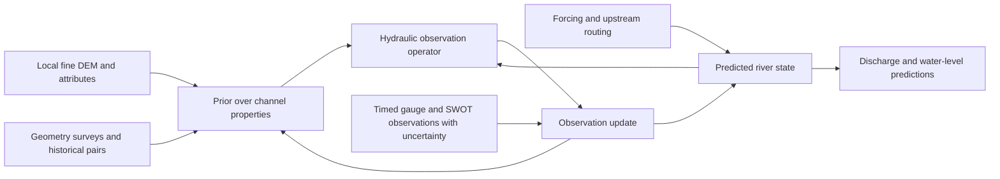

# hydroPFN: measurement assimilation and constrained terrain use

Design analysis, 2026-09-23. This is a proposal, not an implemented or trained
SWOT model. Completed numbers live in
[the protocol](camels531_protocol.md#recovery-pilots-completed-2026-09-23).
Read alongside `G:/Work/Claude/River_Transport/dem_foundation/docs/dev_dem.md`,
particularly the August 25 local-geometry discussion and core insights.

## Specialist parity: possible, not guaranteed by sharing

A model conditioned on task and available information can represent a specialist
solution for each task. There is no mathematical rule that task sampling forces
a fixed accuracy loss. A protected expert route demonstrates existence, although
packaging experts alone does not demonstrate useful shared learning or transfer.

At fixed capacity and compute, learning can still compromise. Paired passes
preserve complete daily examples, but averaged gradients differ from those of
specialist-only training. Shared dynamics with distinct state updates/adapters
is a reasonable middle ground. Compare specialists with the same information,
regions, dates, metrics and budget convention. Sparse WSE cannot be required
to provide the information contained in daily true Q.

Keep separate validation constraints for daily DI, no-Q prediction and each
observation task. A weighted average can hide a regression. Minimizing combined
task risks subject to specialist risk tolerances is a proposed training/selection
design, not a guarantee on a new test set. An exact fallback needs the full
frozen specialist path, including normalization, recurrent history and readout.
A frozen output head alone cannot protect changing shared recurrent states.

Replicate the paired contrast on a common device and select duration/weights
using validation years inside the training era. Rebuild teachers inside that
split; existing full-training teachers have already seen those years. Treat
the future-period benchmark as already inspected. Current near-parity concerns
the recurrent DI pilot; original-PFN forward and unseen-basin performance remain
unresolved. See [the parity analysis](specialist_parity_formulation_20260923.md).

## What the present measurement arm does

Sources: `src/hydropfn/models/measurement_pfn.py` and
`src/hydropfn/train/train_measurement_pfn.py`.

- Predicts `log_W`, `log_d` or `log_v` conditional on **known `log_Q`**.
  Q is mandatory for context and query. This is static conditional geometry
  inference, not discharge inversion or temporal assimilation.
- Has no timestamps, observation latency, uncertainties, sensors, vertical
  datums, spatial supports or network relations.
- Flattens site/visit tokens with only an own-site versus other-site tag.
  There is no explicit binding between each other site's attributes and its
  visits. Add per-example grouping or relational structure, not memorized
  global basin IDs.
- Uses a discretized marginal prediction head. A distributional representation
  does not guarantee calibration; finite fixed bins also restrict extrapolation.

The current trainer needs repair before another measurement benchmark:

1. `SiteStore` fits normalization on the full dataframe before the HUC split;
   `make_borders` uses all target values, including held-out labels. Fit both
   exclusively on training sites.
2. The training neighbor pool includes the query site. If selected, it can
   re-enter another context slot with its target occasion intact. Exclude the
   query site and remove the target occasion across every context path.
   Evaluation sites are disjoint from its training pool; this is not evidence
   of the same direct target leakage during held-out evaluation.
3. Evaluation mode `none` removes own visits but retains neighbors. Add a true
   no-neighbor baseline and match context sets across regime comparisons.
4. Audit the provenance of `log_q_mm_day` before calling it globally available;
   its name alone does not establish leakage or availability.

These findings do not affect the separate recurrent parity runs. They are code
audit findings, not re-estimated historical measurement scores. No measurement
code was changed or new measurement run launched in this analysis.

## Joint state and channel-property inference

Separate changing river state from persistent properties:

- **Fast state x(t):** discharge, water level/storage and hydrologic memory.
  Propagate with meteorology/routing; update at each observation's actual time.
- **Persistent properties phi:** cross-section/bathymetry, hydraulic response,
  roughness and datum offsets. Infer a posterior from attributes, terrain,
  surveys and historical paired observations, retaining it between visits.
  Permit slow changes when morphology or management changes.

A proposed observation model is

    y(event) = H(variable, support; x(t), phi, boundaries) + bias + error.

Hydrology supplies a prior over the state trajectory; DEM/attributes supply
a prior over properties; each observation contributes a likelihood. Measurements
from the same pass/occasion need a joint error model where errors are correlated.
An amortized neural updater can approximate posterior inference with globally
shared weights and local context/state, without retraining weights per basin.

The recurrence must obey forecast issue time. Delayed observations require
a lagged-state update/replay, not relabeling as current measurements. Forecast
filtering and retrospective smoothing need separate evaluation.

Assimilate SWOT WSE, width and water-surface slope as distinct variables.
SWOT is satellite sensing; ground gauges and surveys join the same interface.
Its Q product is derived from hydraulic observations, not an independent direct
Q measurement. Model dependence if both the retrieval and its inputs are used,
or test them as alternatives.
[Andreadis et al. (2025)](https://ntrs.nasa.gov/citations/20250004883).

Map hydrology and measurements to the same reach. Basin runoff in mm/day needs
area conversion and routing before comparison with m3/s. Avoid double counting
upstream total discharge in nested basins. Reach-average satellite width and
a surveyed cross-section have different supports. Preserve reach/node IDs,
units, vertical datum, pass/occasion, acquisition and availability timestamps,
uncertainty, quality flags and missing-variable masks. Use actual pass times,
not one universal revisit interval. PO.DAAC documents
[product quality flags](https://podaac.github.io/tutorials/notebooks/datasets/SWOT_quality_flag_demo.html).

| information | intended inference | remaining ambiguity |
|---|---|---|
| unpaired SWOT series | state changes and partial hydraulic response | absolute Q, bed elevation and roughness may remain confounded |
| occasional independent Q paired with WSE/width | anchor the absolute hydraulic relationship | unsampled flow range; backwater/hysteresis |
| surveyed cross-section and WSE in a common datum | constrain depth and wetted area | roughness, boundaries and velocity |
| observed velocity and compatible wetted area | constrain discharge | spatial support and velocity averaging |
| upstream observations on connected reaches | inflow and propagation | travel time, lateral inputs, storage and withdrawals |

WSE is not depth without a bed reference. Under backwater, unsteady flow or
tides, level need not identify Q uniquely. Use continuity and an appropriate
hydraulic operator with uncertain geometry/boundaries, rather than a universal
Manning inversion. Good Q fit does not imply identified bed and roughness;
the [SWOT joint-estimation experiments](https://swot.jpl.nasa.gov/documents/1503/)
illustrate this. Preserve broad uncertainty when information is insufficient.

Paired observations help without needing pairs at every visit. Train episodes
with variable context lengths, missing variables, flow ranges, outages and
quality. Hold out whole occasions when testing new-event transfer. Same-occasion
conditioning is a legitimate separate task if the auxiliary measurement would
be available and is independent of how the target label was derived. A derived
W*d*v identity is not evidence of generalization to a future hydraulic condition.

Prototype on a limited domain with collocated gauge, survey and SWOT data,
then hold out reaches/regions. Compare hydrology-only, SWOT-only, paired-anchor
and geometry-informed cases at matched availability. Include a specialist
rating/DA baseline, calibration, high-flow extrapolation and performance long
after the most recent observation. A Garonne study supports the value of
combining satellite and in-situ levels, without establishing global transfer:
[Bonassies et al. (2025)](https://arxiv.org/abs/2504.21670).

## DEM: constrain its role, not just its dimension

The existing compression experiment already tested raw features, fold-specific
PCA and a learned narrow bottleneck. The new basin/outlet probe also failed
to improve the attribute baseline. Regularization can reduce harm; it cannot
manufacture absent information or make redundant features complementary.
Successful terrain reconstruction is not itself evidence of downstream value.

Test **fine local terrain as a prior for geometry and the observation operator**.
Valley confinement and floodplain shape have a closer relationship to local
hydraulics than to daily basin discharge. DEM must not be treated as a survey
of submerged bathymetry; its prediction is an uncertain prior.

1. Freeze the pretrained encoder initially. Center patches to remove arbitrary
   elevation offsets; retain meaningful absolute elevation separately when
   needed for climate/snow. Use a fixed training-fold projection or independently
   supervised geomorphic bottleneck, a small residual head and strong shrinkage
   toward zero correction. A learned eight-dimensional vector alone is not
   such a constraint. Zero initialization protects only initialization; an
   explicit no-DEM route preserves the baseline after learning.
2. Supervise on independent geometric properties such as valley cross-section,
   confinement, relief and longitudinal slope. Balance training by site/region:
   repeated daily targets do not create independent terrain samples. Use DEM
   dropout and realistic attribute/measurement masking. Let the correction be
   zero where existing information suffices.
3. Hold out regions and appropriately buffered terrain tiles; fit transforms
   within training folds. Track DEM source, resolution, water coverage and nodata.
   Preserve physical scale/direction during augmentation: do not blindly erase
   north/aspect or river orientation. Propagate inpainting uncertainty instead
   of treating generated terrain as observations.

Use local buffers plus reusable network/catchment summaries. Do not resize a
whole continental basin into one fine-scale patch or repeatedly encode upstream
pixels for every downstream reach. Upstream gauges help where present; global
ungauged inference still needs forcing, area, routing and an upstream property
prior. The completed basin-descriptor extraction was an information diagnostic,
not an unbounded per-query DEM architecture.

## One discriminating terrain test after the parity gate

On repaired leave-region-out measurement evaluation, compare the same baseline
with (a) attributes and measurement context, (b) those inputs plus simple local
geomorphic descriptors, and (c) those inputs plus frozen fine-scale features,
fixed compression and a regularized geometry correction. Match query visits
and context, fit transforms only on training sites, and replicate seeds.

A geographically matched shuffled-DEM control can diagnose generic extra
capacity effects but cannot replace regional holdout. Evaluate zero/few/many
observations: terrain should help most when geometry is uncertain and should
not hurt well-measured reaches. First require an out-of-region geometry or
observation-likelihood gain; then test Q assimilation while preserving the
daily-DI specialist criterion.

Keep the sequence: confirm recurrent parity; repair the measurement interface;
test persistent state/property inference; run this terrain contrast. No new
training batch was launched for this design analysis.
